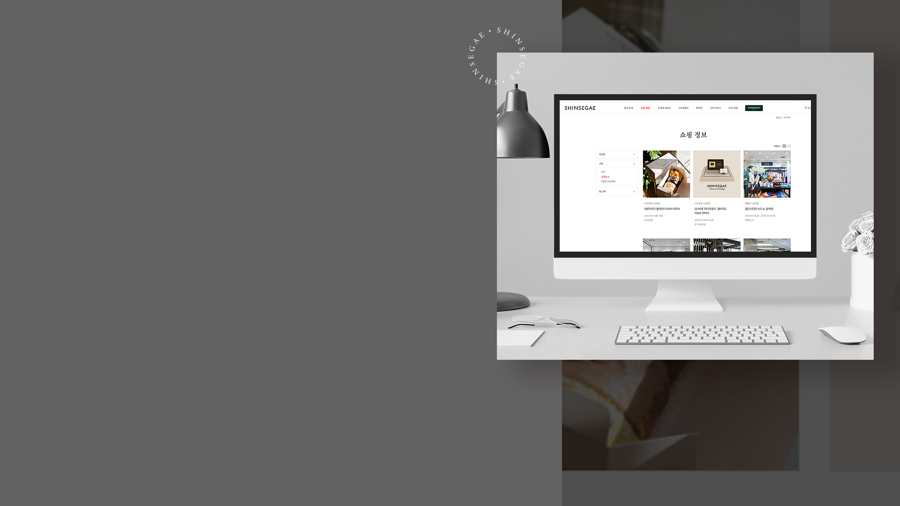
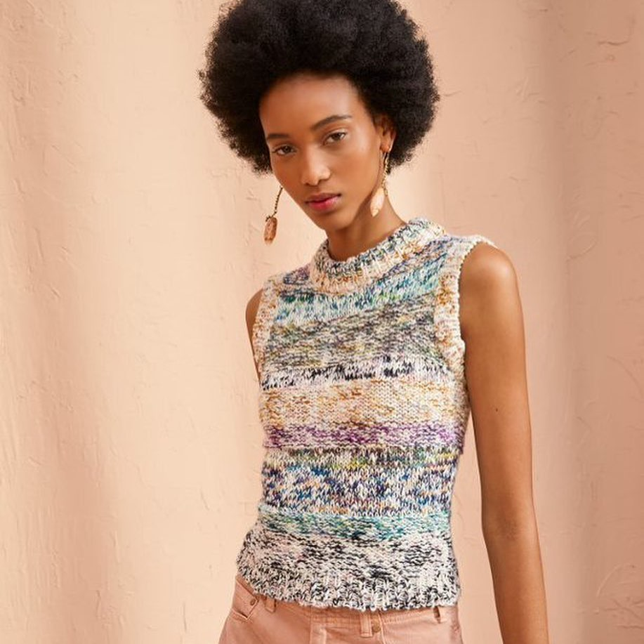

### slick progressbar
```
<div class="slider_wrap">
    <div class="slider">
        <div class="list">
            
            <p>신백멤버스<br>신규가입을 위한<br>웰컴팩을 만나보세요.</p>
        </div>
        <div class="list">
            
            <p>지금 가장 <span>Hot</span>한<br>쇼핑 소식을 확인하세요!</p>
        </div>
        <div class="list">
            
            <p><span>MAGAZINE<br>SHINSEGAE</span></p>
        </div>
    </div>
    <ul class="slide_tab">
        <li>
            01
            <span class="bar"></span>
        </li>
        <li>
            02
            <span class="bar"></span>
        </li>
        <li>
            03
            <span class="bar"></span>
        </li>
        <div class="play"></div>
        <div class="pause"></div>
    </ul>
</div>
```
```
.slider_wrap {
    height: calc(100vh - 103px);
    overflow: hidden;
    position: relative;
    width: 100%;
}

.slider_wrap .slide_tab {
    display: flex;
    position: absolute;
    top: 17%;
    left: 14%;
    z-index: 1;
}

.slide_tab > li {
    width: 70px;
    height: 49px;
    font-family: 'Gill Sans', 'Gill Sans MT', Calibri, 'Trebuchet MS', sans-serif;
    color: rgba(255, 255, 255, 0.5);
    border-bottom: 2px solid rgba(255, 255, 255, 0.5);
    padding: 5px 0 0 8px;
    cursor: pointer;
    position: relative;
}

.slide_tab > li .bar {
    position: absolute;
    bottom: -2px;
    left: 0;
    height: 2px;
    width: 0;
    background-color: #ffffff;
}

.slide_tab li.active {
    border-bottom: 2px solid rgba(255, 255, 255, 0.3);
    font-size: 19px;
    color: #ffffff;
    padding: 0 0 0 8px;
}

.slide_tab > li.active .bar {
    animation: progressBar 5s linear forwards;
}

@keyframes progressBar {
	0% {width: 0;}
	100% {width:100%;}
}

.slide_tab > li.on {
    font-size: 19px;
    color: #ffffff;
    padding: 0 0 0 8px;
}

.slide_tab > li.on .bar {
    width: 100%;
}


.slider_wrap .slide_tab .pause {
    position: absolute;
    bottom: -4px;
    left: 245px;
    background-image: url('../images/ico_kv_pause.png');
    background-position: center;
    background-size: cover;
    background-repeat: no-repeat;
    width: 7px;
    height: 10px;
    cursor: pointer;
}

.slider_wrap .slide_tab .play {
    position: absolute;
    bottom: -4px;
    left: 245px;
    background-image: url('../images/ico_kv_play.png');
    background-position: center;
    background-size: cover;
    background-repeat: no-repeat;
    width: 7px;
    height: 10px;
    cursor: pointer;
    display: none;
}

.slider {
	font-size: 0;
    left: 0;
    width: 100%;
}
.slider .list {
	position: relative;
	height: 100vh;
}
.slider .list img {
	position: absolute;
	top:0;
	left:0;
	width: 100%;
	height: 100%;
	object-fit: cover;
    opacity: 0;
}
```
```
 const $slider = $(".slider");
const $progress = $('.slide_tab > li');

//슬라이드가 실행되면 첫번째 $progress에 active 추가
$slider.on('init', (event, slick) => {
    $progress.eq(0).addClass('active');
});

//슬라이드 실행
$slider.slick({
    autoplay: true,
    autoplaySpeed:5000,
    arrows: false,
    fade: true,
    infinite: true,
    lazyLoad: 'progressive',
});

//슬라이드가 바뀌면 $progress에 active 추가
$slider.on('beforeChange', (event, slick, currentSlide, nextSlide) => {
    $progress.eq(nextSlide).addClass('active').siblings().removeClass('active');
});

//$progress를 클릭했을 때, 해당 슬라이드로 이동
$progress.on('click', function (){
    if (!$(this).hasClass('active')) {
        const barIndex = $(this).index();
        $slider.slick('slickGoTo', barIndex);
    }
});

//정지 버튼
$('.pause').click(function(){
    $(this).hide()
    $('.play').show()
    $slider.slick('slickPause')
    console.log('멈춤')
    $('.slide_tab > li.active').attr('class', 'on')
})

$('.play').click(function(){
    $(this).hide()
    $('.pause').show()
    $slider.slick('slickPlay')
    console.log('재생')
    $('.slide_tab > li.on').attr('class', 'active')
})

```

### 슬라이드 글자 css애니메이션
```

.slider .list p {
	position: absolute;
	top:24%;
	left:17%;
	width: 100%;
	height: 100%;
    font-family: 'Jeju Myeongjo';
    font-size: 70px;
    line-height: 1.2;
    opacity: 0;
}

.slider .list p span {
    font-family: 'Adobe Garamond Pro';
    font-size: 80px;
    line-height: 1;
}


.slider .slick-active .list p {
    animation-name:fadeInLeft;
    animation-duration:1.5s;
    animation-fill-mode: forwards;
}

.slider .slick-active .list img {
    animation-name:fadeInRight;
    animation-duration: 1s;
    animation-fill-mode: forwards;
}

@keyframes fadeInRight {
    0% {
        width: 0;
        opacity:0;
    }
    100% {
        width: 100%;
        opacity:1;
    }
}

@keyframes fadeInLeft {
    0% {
        transform:translateX(50px);
        opacity:0;
    }
    100% {
        transform:translateX(0);
        opacity:1;
    }
}
```

### (플러그인) ScrollReveal

```
    ScrollReveal().reveal('.news h2', {
        distance: '50px',
        origin: 'bottom',
        easing: 'ease-in-out',
        delay: 0
    });
    
    ScrollReveal().reveal('.news > p', {
        distance: '30px',
        origin: 'bottom',
        easing: 'ease-in-out',
        delay: 100
    });
    
    ScrollReveal().reveal('.content_wrap .col_01', {
        distance: '30px',
        origin: 'bottom',
        easing: 'ease-in-out',
        delay: 200
    });
    
    ScrollReveal().reveal('.content_wrap .col_02', {
        distance: '30px',
        origin: 'bottom',
        easing: 'ease-in-out',
        delay: 300
    });

```

### 썸네일 hover 이벤트
#### 이미지 확대, 어둡게
```
.section.news .content_wrap > a:hover .photo::after {
    content: '';
    position: absolute;
    z-index: 2;
    background: rgba(31,31,31,0.2);
    top: 0;
    left: 0;
    width: 100%;
    height: 100%;
}

.section.news .content_wrap > a:hover img {
    transform: scale(1.05);
}

a .photo {
    position: relative;
    overflow: hidden;
    transition: all 0.8s;
    width: 395px;
}

a .photo img {
    width: 100%;
    height: 100%;
    object-fit: contain;
    display: block;
    transition: all 0.8s;
}
```

### hover 이벤트 슬라이딩(세로)
```
<li class="card_01">
    
    <div>
        <a href="#x">YOUTUBE</a>
        <p>신세계 친환경 쇼핑백<br> 패키지가 만들어지는<br> 과정을 함께하세요!</p>
        <button>more</button>
    </div>
</li>
```
```
.cards li div {
    position: absolute;
    bottom: 2px;
    left: 0;
    width: 100%;
    transform: translateY(100%);
    background-color: rgba(0, 0, 0, 0.8);
    color: white;
    padding: 30px 26px 40px;
    border-top: 2px solid #F22C2D;
    transition: all 0.5s;
}
```
```
    $('.cards li').hover(function(){
        $(this).find('div').css('transform', 'none')
    }, function(){
        $(this).find('div').css('transform', 'translateY(100%)')
    })
```

### 배열로 슬라이드
#### 배경 색, 글자 바꾸기
```
<div id="text_wrap">
    <p>SHINSEGAE GALLERY</p>
    <div id="from"></div>
    <div id="title"></div>
    <button class="view_more white">
        <span>VIEW MORE</span>
    </button>
    <div class="btns">
        <div class="prev"></div>
        <div class="next"></div>
    </div>
</div>
```
```
const bgcolor = ['#5B2F44', '#5D540B', '#207844', '#184A4D', '#1B778B']

const banners = [
    {
        id: 1,
        from: '대전신세계 Art & Science',
        title: 'DYAF 23 : 대전청년작가장터',
      },
    {
        id: 2,
        from: '광주신세계',
        title: '떠나보낸, 함께 살아가야 할',
      },
    {
        id: 3,
        from: '대구신세계',
        title: '에코토피아 Ecotopia',
      },
    {
        id: 4,
        from: '본점',
        title: 'RABBIT FRIENDS:김한나, 송형노',
      },
    {
        id: 5,
        from: '신세계 아카데미',
        title: '여름학기 수강회원 모집',
      },
]

const from = document.getElementById('from')
const title = document.getElementById('title')
const prev = document.querySelector('.prev')
const next = document.querySelector('.next')
const bgArea = document.getElementById('text_wrap')

let idx = 0

next.addEventListener('click', () => {
    idx++
    if(idx > banners.length - 1) idx = 0
    showBanner()
})

prev.addEventListener('click', () => {
    idx--
    if(idx < 0) idx = banners.length - 1
    showBanner()
})

function showBanner() {
    from.textContent = banners[idx].from
    title.textContent = banners[idx].title
    bgArea.style.backgroundColor = bgcolor[idx]
}

function init() {
    showBanner()
}

init()

```

### (플러그인) slick tab스타일 + magnificPopup
```
<div class="section brand">
    <h2>#Shinsegae Brand</h2>
    <div class="tab_slick">
        <div class="boontheshop"></div>
        <div class="addir"></div>
        <div class="onoma"></div>
    </div>
    <div class="prevArrow"></div>
    <div class="nextArrow"></div>
    <div class="brand_contents">
        <div class="gallery_wrap addir">
            <div class="brand_desc col_02">
                <h3>시대를 초월한 아름다움을 추구하는<br>Timeless Luxury Jewelry</h3>
                <p>다이아몬드 본연의 아름다움을 강조한<br>클래식한 디자인부터, 독창적인 디자인까지.<br>우아하고 아름다운 세계를 만나보시기 바랍니다.</p>
                <a href="#x">detail</a>
            </div>
            <div class="popup-gallery addir">
                <a class="simple-ajax-popup col_01" href="../pages/modal_ajax/addir_01.html"></a>
                <div></div>
                <a class="simple-ajax-popup col_03" href="../pages/modal_ajax/addir_02.html"></a>
                <a class="simple-ajax-popup col_01" href="../pages/modal_ajax/addir_03.html"></a>
                <a class="simple-ajax-popup col_02" href="../pages/modal_ajax/addir_04.html"></a>
                <a class="simple-ajax-popup col_03" href="../pages/modal_ajax/addir_05.html"></a>
            </div>
        </div>
        <div class="gallery_wrap onoma">
            <div class="brand_desc col_02">
                <h3>개개인의 아름다움을 위한 약속<br>에센스 중심 스킨케어 브랜드 오노마</h3>
                <p>오노마의 에센스는 레이어링 방식에 따라<br>개개인의 피부 컨디션을 케어하는데<br>도움을 주는 제품입니다.</p>
                <a href="#x">detail</a>
            </div>
            <div class="popup-gallery onoma">
                <a class="simple-ajax-popup col_01" href="../pages/modal_ajax/onoma_01.html">
                    <video muted autoplay="autoplay" loop>
                        <source src="../images/onoma_01.mp4" type="video/mp4" alt="오노마 에센스 영상">
                    </video>
                </a>
                <div></div>
                <a class="simple-ajax-popup col_03" href="../pages/modal_ajax/onoma_02.html"></a>
                <a class="simple-ajax-popup col_01" href="../pages/modal_ajax/onoma_03.html"></a>
                <a class="simple-ajax-popup col_02" href="../pages/modal_ajax/onoma_04.html"></a>
                <a class="simple-ajax-popup col_03" href="../pages/modal_ajax/onoma_05.html">
                    <video muted autoplay="autoplay" loop>
                        <source src="../images/onoma_02.mp4" type="video/mp4" alt="오노마 에센스 영상">
                    </video>
                </a>
            </div>
        </div>
        <div class="gallery_wrap boontheshop">
            <div class="brand_desc col_02">
                <h3>MODERN LUXURY STORE<br>BOONTHESHOP</h3>
                <p>패션, 문화, 예술, 음식 등에서<br>세련된 취향을 지닌 이들을 모두 만족시키는<br>모던 럭셔리 스페셜티 스토어</p>
                <a href="#x">detail</a>
            </div>
            <div class="popup-gallery boontheshop">
                <a class="simple-ajax-popup col_01" href="../pages/modal_ajax/boontheshop_01.html"></a>
                <div></div>
                <a class="simple-ajax-popup col_03" href="../pages/modal_ajax/boontheshop_02.html"></a>
                <a class="simple-ajax-popup col_01" href="../pages/modal_ajax/boontheshop_03.html"></a>
                <a class="simple-ajax-popup col_02" href="../pages/modal_ajax/boontheshop_04.html"></a>
                <a class="simple-ajax-popup col_03" href="../pages/modal_ajax/boontheshop_05.html"></a>
            </div>
        </div>
    </div>
    <button class="view_more">
        <span>VIEW MORE</span>
    </button>
</div>
```
```
// tab 스타일
.tab_slick .slick-slide {
    opacity: 0.5;
}

.tab_slick .slick-center {
    opacity: 1;
    transition: opacity 0.3s linear;
}
```
```
    $('.tab_slick').slick({
        centerMode: true,
        centerPadding: '470px',
        initialSlide: 1,
        prevArrow : $('.prevArrow'), 
        nextArrow : $('.nextArrow'),
    })

    $('.prevArrow').click(function(){
        var prevName = $('.slick-center').prev().find('div > div').attr('class');
        console.log(prevName)
        if(prevName == 'addir'){
            $('.gallery_wrap.addir').show().siblings().hide()
        }else if(prevName == 'onoma'){
            $('.gallery_wrap.onoma').show().siblings().hide()
        }else{
            $('.gallery_wrap.boontheshop').show().siblings().hide()
        }
    })

    $('.nextArrow').click(function(){
        var nextName = $('.slick-center').next().find('div > div').attr('class');
        console.log(nextName)
        if(nextName == 'addir'){
            $('.gallery_wrap.addir').show().siblings().hide()
        }else if(nextName == 'onoma'){
            $('.gallery_wrap.onoma').show().siblings().hide()
        }else{
            $('.gallery_wrap.boontheshop').show().siblings().hide()
        }
    })
    
    $('.popup-gallery.addir').magnificPopup({
        delegate: 'a',
        type: 'ajax',
        tLoading: 'Loading image #%curr%...',
        mainClass: 'mfp-img-mobile',
        closeOnContentClick: false,
        closeOnBgClick: false,
        gallery: {
            enabled: true,
            navigateByImgClick: true,
            preload: [0,1] // Will preload 0 - before current, and 1 after the current image
        },
        image: {
            tError: '<a href="%url%">The image #%curr%</a> could not be loaded.',
            titleSrc: function(item) {
                return item.el.attr('title') + '<small>by Marsel Van Oosten</small>';
            }
        },
    });
```

### 스크롤 영역 만들기
```
.scroll_area {
    max-height: 100vh;
    overflow-y: scroll;
    margin-bottom: 80px;
}
```
